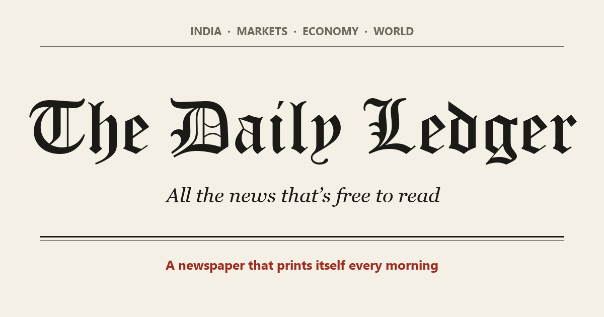

# The Daily Ledger

**Read it: [frosty6699.github.io/daily-ledger](https://frosty6699.github.io/daily-ledger/)**

A free newspaper that prints itself every morning. At about 6 AM India time, a small Python program
reads the public RSS feeds of 20 publishers and builds the day's paper. The publishers include
The Economic Times, Business Standard, Mint, BusinessLine, CNBC, BBC, The Guardian, Reuters, WSJ,
FT and Bloomberg.

The program does five things:

- **Groups stories.** When several papers cover the same news, it becomes one story with every
  paper's name on it.
- **Ranks the front page.** The front page holds the stories the most papers are writing about.
- **Sorts into sections.** Markets, Economy & Policy, Companies & Deals, World, Technology and Opinion.
- **Adds data.** A markets strip (Nifty, Sensex, rupee, Brent, gold, S&P 500, US 10-year yield), plus
  the latest RBI and US Fed press releases.
- **Links everything to the original.** Nothing gets around a paywall. Subscriber-only stories (WSJ,
  FT, Bloomberg, ET Prime, Mint Premium and others) appear on the Subscriber Desk, with only the
  headline and summary the publisher gives away free.

Every past edition stays online under **All editions**.

## How it works

- `build_paper.py` is the whole paper. It uses only Python's standard library.
- `.github/workflows/print.yml` runs it every morning on GitHub Actions. The workflow saves the
  edition to `editions/` and publishes the site to GitHub Pages.
- To print a fresh edition now: open **Actions → Print the paper → Run workflow**. This works from
  the GitHub app on a phone too.

To add or remove a source, edit the `SOURCES` list at the top of `build_paper.py`.

## Credits

Headlines, summaries and pictures belong to their publishers. Every story links back to the original.
If you're a publisher and would like your feed left out, open an issue and it will be removed.
